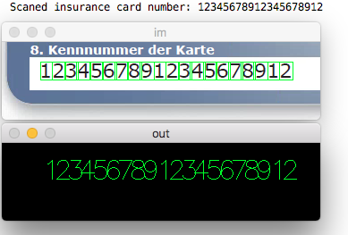

# pyautodigits
A python cross-platform module to recognize digits on images

## How it works?
The code works simple as two parts. The aim of the first part is to train the script with possible images. 
Once the training is done, you can test your scanned image (i.e. credit card or insurance card).

## Frameworks to be installed
```javascript
Python-2.7.x.
numpy
opencv
```
## Demo training video
Simply tap on the keyboard key that is displayed in a red rectangle
[](https://www.youtube.com/watch?v=desRsZO5Oa8)

## How to train?
Open a terminal, go to the folder and run the following command:
```javascript
python digit_recognizer_training.py
```

## How to test?
Open a terminal, go to the folder and run the following command:
```javascript
python digit_recognizer_testing.py
```

## Sample recognition output
Here you can see the output of a successful digits recognition:


